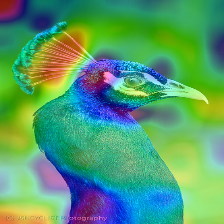
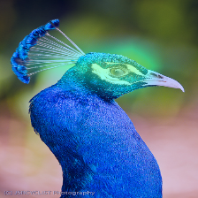
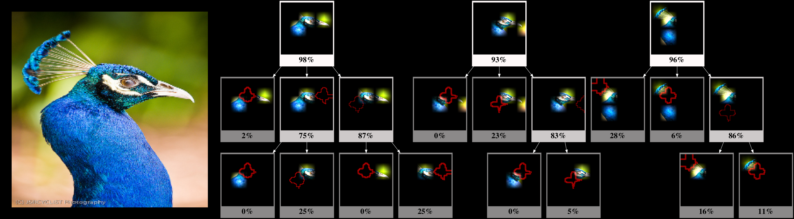
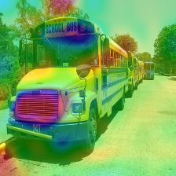
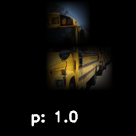

# structured-attention-graphs

# Abstract
Attention maps are popular tools of explaining the decisions of convolutional networks for image classification. Typically for each image of interest, a single attention map is produced, which  assigns  weights  to  pixels  based  on  their  importance to  the  classification.  We  argue  that  a  single  attention  map provides an incomplete understanding since there are often many other maps that explain a classification equally well. In this paper, we introduce *structured attention graphs (SAGs)*, which compactly represent sets of attention maps for an image  by  capturing  how  different  combinations  of  image  regions impact the confidence of a classifier. We propose an approach to compute SAGs and a visualization for SAGs so that deeper insight can be gained into a classifier’s decisions.

[arxiv][https://arxiv.org/pdf/2011.06733]

# Demo

### Example: *Peacock*

  |    |  | 
:-------------------------:|:-------------------------:|:-------------------------:|:-------------------------:
Original Image | Grad-CAM | I-GOS | _**Ours**_

||
|:-------------------------:|
|_**SAG**_|

### Example: *School bus*

  |    |  | 
:-------------------------:|:-------------------------:|:-------------------------:|:-------------------------:
Original Image | Grad-CAM | I-GOS | _**Ours**_

||
|:-------------------------:|
|_**SAG**_|

## Installing dependencies:
`bash requirements_install.sh`

## To run:
`python main_generate_sag.py`

## Directory description:
- *search.py* -- functions to perform search (beam search or combinatorial search) on a perturbation mask
- *diverse_subset_selection.py* -- functions to obtain a diverse subset from a set of candidate masks
- *get_perturbation_mask.py* -- functions to obtain a perturbation mask
- *patch_deletion_tree.py* -- functions to build a tree by deleting one patch at a time
- *utils.py* -- helper functions
- *main_generate_sag.py* -- main file to generate SAG
- *Images* -- folder consisting of input images for which we build SAGs
- *Results* -- all results are populated here
- *GroundTruth1000.txt* -- IMAGENET groundtruth labels
- *requirements_conda.txt* -- lists all conda libraries dependencies
- *requirements_pip.txt* -- lists all pip libraries dependencies
